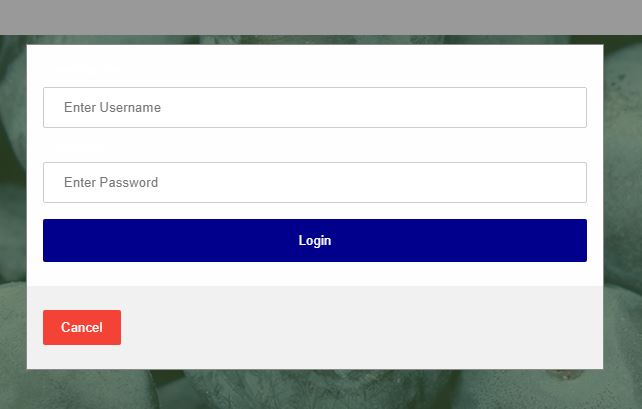
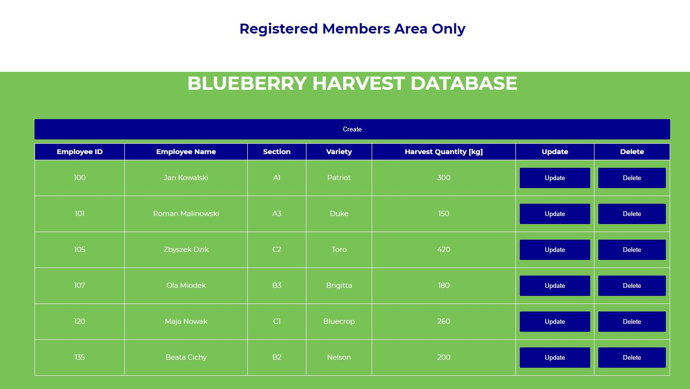

<h1 align="center"> Data Representation Project 2020  </h1><br>
<h3 align="left"><i>Maciej Burel<i> </h3>
<h3 align="left"><i>G00376332<i> </h3><br><br>

### This folder contains the final project for the Data Representation and Querying Module.

The project uses the following files:

|    File                       |      Description                                                                                       | 
|:------------------------------|:-------------------------------------------------------------------------------------------------------|
| data.sql                      |   SQL code to create the database, create the table and populate the table                             |
| dbconfig.py                   |   Configuration file for DAO                                                                           |
| BalticDao.py                  |   DAO Pattern - CRUD operations                                                                        |
| server.py                     |   Flask server that implements a REST API that performs CRUD operations and authorization(logging in)  |
| templates/index.html          |   HTML for home page                                                                                   |
| templates/harvestviewer.html  |   HTML that uses AJAX to link to the server and provide a user interface                               |
| templates/project.js          |   Java Script file for HTML pages                                                                      |
| templates/css/main.css        |   Main css file for HTML pages                                                                         |
| requirements.txt              |   List of necessary packages                                                                           |

### My Project is hosted on [Pythonanywhere](baltic.pythonanywhere.com)
***

Login details are follows:

- username: admin
- password: password

### How to run the code on the local host
***

The following items are required to run project in local folder.

- [Python 3.7.9](https://www.python.org/downloads/release/python-379/) The most convenient way is to use the Anaconda package.
- [MySql](https://www.mysql.com/) MySql enviroment that holds databases.
- [Flask](https://flask.palletsprojects.com/en/master/installation/)
- [mysql_connector](https://pypi.org/project/mysql-connector-python/)

Download project from git to your machine.<br> 
From MySql application installed locally run console and execute commands from data.sql file.<br> 
It can be done one by one or by using command below it will execute everything in one go.<br> 

- source your_path_to_the_folder\52957-DataRepresentationProject\data.sql<br>

Those instructions will create the database baltic and two tables harvest and users that hold all data.<br><br> 
Navigate to the project folder and create virtual environment.<br> 
```
python -m venv venv 
.\venv\Scripts\activate.bat
```
Install requirments from the file<br> 
```
pip install -r requirements.txt
```
To run flask<br> 

```
set FLASK_APP=server.py
echo %FLASK_APP%
flask run
```
Open web browser and put in the address bar <http://127.0.0.1:5000/><br> 


### Project and database description
***

The project contains harvest data by employee for bluberry farm.<br>

#### MySql database
***

The database **baltic** contains two tables.

- harvest
- users

The harvest table holds data of quintity, variety and plot section by employee.
The users table contains usernames and passwords.

#### Harvest
***

The schema of harvest table is below:

| Field          | Type         | Null | Key | Default | Extra          |
|----------------|--------------|------|-----|---------|----------------|
| id             | int          | NO   | PRI | NULL    |                |
| employeeName   | varchar(250) | YES  |     | NULL    |                |
| fieldSection   | varchar(250) | YES  |     | NULL    |                |
| variety        | varchar(250) | YES  |     | NULL    |                |
| quantity       | int          | YES  |     | NULL    |                |


#### Users
***
The schema of harvest table is below:

| Field          | Type         | Null | Key | Default | Extra          |
|----------------|--------------|------|-----|---------|----------------|
| id             | int          | NO   | PRI | NULL    | auto_increment |
| username       | varchar(250) | YES  |     | NULL    |                |
| password       | varchar(250) | YES  |     | NULL    |                |

#### HTML
***
The are two webpages, one is welcome screen and the other one is webpage that disply database data.
To get access to data part user must loging first and that is checked for whole duration of the session.
By pressing login button from the menu a login box will pop up. <br>

<br>

When access is granted the user can view, create, update and delete harvest data.

<br>


